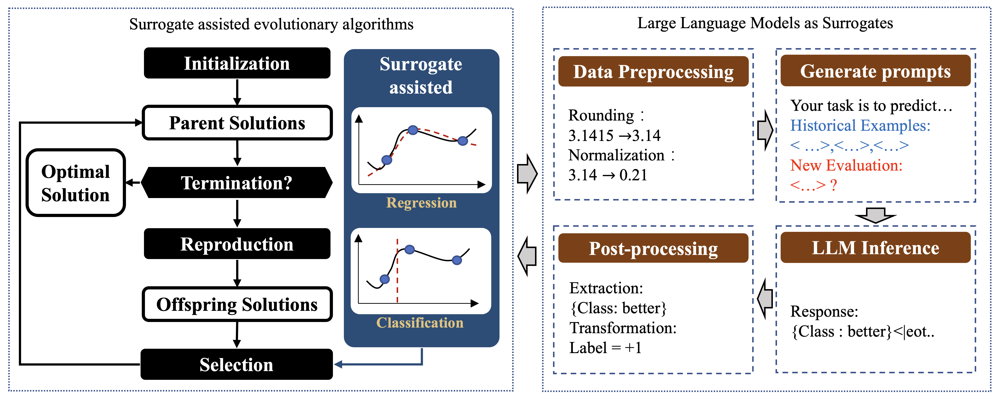

# Large Language Models as Surrogate Models in Evolutionary Algorithms: A Preliminary Study


<p align="center">
  
</p>

Large Language Models (LLMs) have achieved significant progress across various fields and exhibited strong potential in evolutionary computation, such as generating new solutions and automating algorithm design. Surrogate-assisted selection is a core step in evolutionary algorithms to solve expensive optimization problems by reducing the number of real evaluations. Traditionally, this has relied on conventional machine learning methods, leveraging historically evaluated data to predict the performance of new solutions.

In this repository, we propose a novel surrogate model based purely on LLM inference capabilities, eliminating the need for training. Specifically, we formulate model-assisted selection as a classification and regression problem, utilizing LLMs to directly evaluate the quality of new solutions based on historical data. This involves predicting whether a solution is good or bad, or approximating its value. This approach is then integrated into evolutionary algorithms, termed LLM-assisted EA (LAEA).

---
## Installation

```
cd LSEA
conda create -n LSEA python=3.10
conda activate LSEA
pip install -r requirements.txt
python setup.py develop

python run_lsea.py
```

## Model Inference Backend

This code supports three model inference backends: `ollama`, `vllm`, and the `OpenAI API`. Users can select the backend according to their needs.

### Ollama
Ensure that you have installed `ollama` and downloaded the pretrained model. Then set `backend = 'ollama'` in `config.yaml`. It is recommended to use the `mixtral:latest` model.

```bash
# Example configuration for ollama backend
backend = 'ollama'
```

### VLLM
Ensure that you have installed `vllm` and downloaded the pretrained model. Then set `backend = 'vllm'` in `config.yaml`. Start the VLLM service using the command below. It is recommended to use the `Llama-3-8B-Instruct` model.

```bash
python -m vllm.entrypoints.openai.api_server --model LLM-Research/Meta-Llama-3-8B-Instruct --port 5803 --tensor-parallel-size 2
```

```bash
# Example configuration for vllm backend
backend = 'vllm'
```

### OpenAI API
Configure your OpenAI API key and base URL, then set `backend = 'openai'` in `config.yaml`.

```bash
# Example configuration for OpenAI API backend
backend = 'openai'
```

**Note:** This may incur some costs.

---


## Only used LLMs as surrogate models for regression and classification tasks

```python

from model.surrogate import LLM_Classification,LLM_Regression

n_features = 5

# For Classification
X, y = make_classification(n_samples=100, n_features=n_features,random_state=42)
y = y * 2 - 1
X_train, X_test, y_train, y_test = train_test_split(X, y, test_size=0.5, random_state=42)


model = LLM_Classification()

model.fit(X_train, y_train)
pre = model.predict(X_test[:2])
print(pre)


# For Regression
from sklearn.datasets import make_regression
X, y = make_regression(n_samples=100, n_features=n_features,random_state=42)
y.flatten()

X_train, X_test, y_train, y_test = train_test_split(X, y, test_size=0.5, random_state=42)
model = LLM_Regression()

model.fit(X_train, y_train)
pre = model.predict(X_test[:2])
print(pre)
```

---


## Large Language Models assisted Evolutionary Algorithms (LSEA)

```python
from problem.LZG import LZG01
from pymoo.optimize import minimize

from alg.lsea import LSEA


if __name__=='__main__':

    problem = LZG01(n_var=5)

    algorithm = LSEA(pop_size=50)


    res = minimize(problem,
                   algorithm,
                   ('n_evals', 300),
                   verbose=True)

```


## Limitations:

This is a preliminary study that uses LLMs (Large Language Models) as surrogate models for evolutionary algorithms. It does not provide performance beyond traditional evolutionary algorithms. Due to time constraints, we have only tested a limited number of test functions. We hope this work can inspire more researchers to explore the application of LLMs as surrogate models in evolutionary algorithms.

---
## Cite this work:

[arxiv](https://arxiv.org/pdf/2406.10675)
  
  ```bibtex
@misc{hao2024large,
      title={Large Language Models as Surrogate Models in Evolutionary Algorithms: A Preliminary Study}, 
      author={Hao Hao and Xiaoqun Zhang and Aimin Zhou},
      year={2024},
      eprint={2406.10675},
      archivePrefix={arXiv},
      primaryClass={cs.NE}
}
  ```